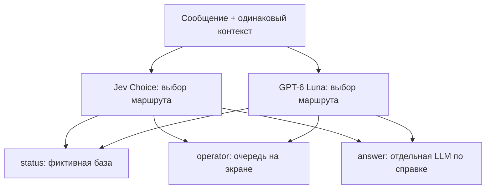

# Jev Router Bench

Воспроизводимый эксперимент для **AI Techie**: один русский запрос магазина
«Лист» → Jev Choice и GPT-6 Luna → `status` / `operator` / `answer`.

**Состояние: offline harness готов; реальные API-результаты пока отсутствуют.**
Платный бюджет и бизнес-правила ждут review владельца. Качество, скорость и цену
моделей здесь пока нельзя сравнить. [Отчёт о готовности](results-summary.md).
Сохранённый [offline-контроль](results/published/offline-control-v1/results-summary.md)
показывает полный формат отчёта на простом алгоритме по ключевым словам; API не вызывается.

Задача — показать разницу между выбором маршрута и генерацией ответа. Проверка
статуса читает фиктивную базу, оператор — очередь на экране, информационный ответ
составляет отдельная LLM. Главный benchmark измеряет **только выбор маршрута**.



Исполнители на схеме описывают следующий этап демонстрации; в runner они не
вызываются. UI и replay появятся после настоящего прогона, с измеренными цифрами.

## Быстрый старт — бесплатно, без ключей

Python 3.11 или новее. Зависимостей и установки пакетов нет.

```sh
git clone https://github.com/feD0s/jev-router-bench.git
cd jev-router-bench
make check
make dry-run
make estimate
python3 -m bench report --dir results/local/dev-dry
```

`make dry-run` выполняет **локальный контроль по ключевым словам**, формирует
нативные запросы обеих моделей и отчёт JSON/CSV/Markdown/SVG. Это реальные результаты
простого локального алгоритма, без Jev/GPT latency или качества. Каталог запуска
не перезаписывается: для повторения укажи новый `--out`.

```sh
python3 -m bench dry-run --split final --out results/local/final-control-1
python3 -m bench estimate --split final --runs 1 --save results/local/budget.json
```

## Набор и протокол

- 20 dev-примеров отдельно; 100 финальных: 60 обычных, 30 сложных, 10 adversarial.
- Финальные метки: 33 status, 34 operator, 33 answer. Синтетические русские данные,
  исходная разметка AI, проверка человеком ещё не проведена.
- Общие правила заморожены до теста; нет LLM-судьи. Exact match, macro-F1, матрицы,
  доля оператора, неверная автоматизация, ошибки, все расхождения и исходные сообщения.
- Основной режим: `jev-1.13.0`, `gpt-6-luna`, `reasoning.effort=none`, один route,
  одна пара за другой с чередованием порядка; никакого скрытого reasoning default.
- До 3 отдельных повторов; каждый использует те же 100 задач. Нет увеличения
  независимой выборки, Batch, гонки, confidence-gating или исполнителей в основной строке.

Подробности: [правила](docs/business-rules.md), [dataset card](docs/dataset-card.md),
[протокол](docs/evaluation-protocol.md), [API/цены](docs/references/api-verification.md).

## Платный запуск — после review и разрешения на бюджет

Сейчас не выполнялся. До него владелец проверяет [конкретные спорные случаи](docs/owner-review.md)
и весь набор. После подтверждения человек или агент по его прямому поручению ставит
`approved: true`, `reviewer`, `reviewed_on` и актуальные hashes в `data/owner-review.json`,
сохраняет согласование в плане и коммитит изменения. Команда сама не является
поручением агенту потратить деньги.

```sh
cp .env.example .env
# Впиши два ключа в локальном редакторе; не передавай их в командной строке/чате.
# Повторно проверь официальные тарифы и доступ аккаунта перед live-запуском.
python3 -m bench live --split dev --runs 1 --approve-spend-usd 0.15 --max-requests 80 --out results/live/dev-1
# После dev-проверки заморозь выбранные настройки; финальные ошибки для настройки не использовать.
python3 -m bench live --split final --runs 1 --approve-spend-usd 1 --max-requests 400 --out results/live/final-1
python3 -m bench report --dir results/live/final-1
```

Это **примеры будущих команд**, не согласованный расход. Цена по плановой
эвристике, консервативные резервы и предложение лимита: [budget-proposal.json](docs/budget-proposal.json).
Отдельный dev-запуск входит в общий согласованный бюджет, не возникает автоматически.

Live требует чистого Git и review с hashes. Каждый POST ограничен 20 секундами
до полного ответа, серия — 2 часами, максимум 400 попыток на один финальный проход
(1200 на три, при отдельном согласовании бюджета). Ошибки транспорта
останавливают серию; неполученный ответ может быть оплачен. Ретраи 429/5xx/529
ограничены двумя попытками и учитываются в расходе. Лимит резервирует стоимость
до отправки; это клиентская защита на основании опубликованных ставок, не гарантия
счёта провайдера. При неизвестном usage остаётся консервативный резерв. Нельзя
обнулить ошибочный запрос или продолжить после смены версии модели.

## Артефакты

В каталоге каждого запуска: `manifest.json`, `cases.json`, `attempts.jsonl`,
`aggregates.json/csv`, `decisions.csv`, `errors.csv`, `disagreements.csv`,
`results-summary.md`, `confusion-run*-*.svg`. Manifest содержит Git commit, hashes,
точный prompt/config, фиктивный магазин, даты и среду. Raw API тела сохраняются
после удаления секретов; Authorization и полные HTTP-заголовки не записываются.
Папки локальных/live-запусков игнорируются Git. Для публикации результаты после
проверки копируются в `results/published/<run-id>/`; содержимое не подменяется.

## Harness engineering

Применение практик [OpenAI](https://openai.com/index/harness-engineering/):
короткий [AGENTS.md](AGENTS.md) как карта, знание в репозитории,
[архитектура](ARCHITECTURE.md) с проверяемыми границами, [живой план](docs/exec-plans/active/experiment.md),
проверка форм на границе API, versioned evidence и полезные offline-тесты.
[Связь принципов с файлами](docs/harness-engineering.md). CI/CD и GitHub Actions
по просьбе владельца отсутствуют; проверки запускаются локально.

## Ограничения

Синтетические сбалансированные задачи не отражают частоты реального магазина.
Метки AI требуют человеческой проверки. 100 задач не подтверждают общее
превосходство; p95 нестабилен, сеть и порядок могут влиять на latency. Публичный
holdout доступен будущим моделям/агентам и не является защищённым тестом. У GPT
официальная страница публикует ID без датированного snapshot, поэтому точная
воспроизводимость весов не гарантирована. Подробности в протоколе.

Авторское медиа: AI Techie. Код и данные эксперимента — единственный источник в
этом репозитории. Редакционные материалы и личные выводы ведутся отдельно.
